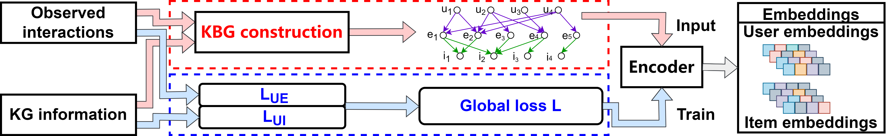

# InvG: Invariant Decomposition of Graph for Out-of-Distribution Generalization
<!--#### -->
## Introduction

 With accumulating evidence underscoring the susceptibility of Graph Neural Networks (GNN) to distribution shifts, there has been a growing emphasis on the exploration of Graph Invariant learning.
Current methods in graph invariant learning often assume the existence of subgraphs within the input graph that maintain invariant relationships with labels. However, in numerous real-world scenarios, such invariant relationships cannot be directly discerned from the input graph. In this paper, we introduce a novel method, \textbf{Inv}ariant Decomposition \textbf{G}raph Learning (\textbf{InvG}), designed to achieve out-of-distribution (OOD) generalization on such graphs.
Inspired by Information Theory, InvG initially decomposes the input graph into a processed graph interconnected by entities representing edge-formulation causal factors. The processed graph contains the invariant pattern and has been proved to effectively mitigate the influence of spurious correlations between the input and labels.
  Leveraging this processed graph, InvG employs a contrastive-learning based invariant pattern learning approach to assist GNN in capturing the invariant pattern. This innovative design empowers the model to capture the invariant pattern, constituting a valid OOD solution. Experimental results on real-world datasets showcase that InvG significantly enhances performance compared to state-of-the-art baselines.

<!--  -->
## Datasets

* [Amazon-book](http://jmcauley.ucsd.edu/data/amazon)

* [LastFM](https://grouplens.org/datasets/)

* [Yelp2018](https://www.yelp.com/dataset/challenge)

* [MovieLens](https://grouplens.org/datasets/movielens/)

## Requirements

* python >= 3.9

* torch>=1.7.0

* dgl>=0.7.0

* scikit-learn>=0.24.0


### Command and configurations

#### on Amazon-book
```bash
python -u main.py --model_type baseline  --dataset amazon-book --gpu_id 0 --ue_lambda 0.1 --idf_sampling 1 --layer_size [64,32,16] --embed_size 64 --lr 0.0001 --epoch 3000 --verbose 1 --save_flag 1 --pretrain -1 --batch_size 8192 --sprate 1
```
#### on LastFM
```bash
python -u main.py --model_type baseline --dataset last-fm --gpu_id 0 --ue_lambda 0.1 --idf_sampling 1 --layer_size [64,32,16] --embed_size 64 --lr 0.0001 --epoch 3000 --verbose 1 --save_flag 1 --pretrain -1 --batch_size 8192 --sprate 1
```
#### on Yelp2018
```bash
python -u main.py --model_type baseline --dataset yelp2018 --gpu_id 0 --ue_lambda 0.1 --idf_sampling 1 --layer_size [64,32,16] --embed_size 64 --lr 0.0001 --epoch 3000 --verbose 1 --save_flag 1 --pretrain -1 --batch_size 8192 --sprate 1
```
#### on MovieLens
```bash
python -u main.py --model_type baseline --dataset movie-lens --gpu_id 0 --ue_lambda 0.4 --idf_sampling 1 --layer_size [64,32,16] --embed_size 64 --lr 0.0001 --epoch 3000 --verbose 1 --save_flag 1 --pretrain -1 --batch_size 8192 --sprate 1
```
#### General flags

```{txt}
optional arguments:
  --dataset                       dataset                               
  --idf_sampling                  negative entity number
  --layer_size                    size of each layer
  --embed_size                    dimension of embedding vector 
  --epoch                         max epochs before stop
  --pretrain                      use pretrain or not
  --batch_size                    batch size
```
